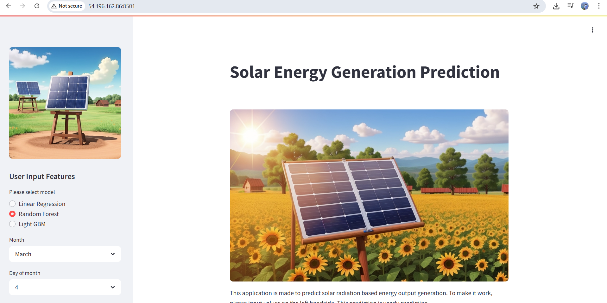

# Deploying a Streamlit/Flask Application on AWS EC2

This guide details the steps to deploy a Python-based application (SolarX) using Streamlit and Flask on an AWS EC2 instance.

## STEP 1: Launch EC2 Instance

1.  **Launch Instance:**
    * Navigate to the EC2 dashboard in the AWS Management Console.
    * Click "Launch instance.
    * Provide a name for your instance.
    * Select an appropriate Amazon Machine Image (AMI) (e.g., Ubuntu).
    * Choose or create a key pair for SSH access.
    * Configure security group settings to allow inbound traffic on port 8501.

## STEP 2: Connect to EC2 via SSH

1.  **SSH Connection:**
    * Open a terminal and use the following command to connect to your EC2 instance:
        ```bash
        ssh -i your-key.pem ubuntu@<your-ec2-public-ip>
        ```
    * Replace `your-key.pem` with the path to your key pair file and `<your-ec2-public-ip>` with the public IP address of your EC2 instance.
2.  **Install Git (if needed):**
    * Check if Git is installed:
        ```bash
        git --version
        ```
    * If Git is not installed, install it:
        ```bash
        sudo apt update
        sudo apt install git -y
        ```
3.  **Clone Repository:**
    * Clone the SolarX repository:
        ```bash
        git clone https://github.com/MainakRepositor/SolarX.git
        ```
4.  **Navigate to Repository:**
    * Change directory to the cloned repository:
        ```bash
        cd SolarX
        ```

## STEP 3: Install Dependencies and Set Up Virtual Environment

1.  **Install Python 3:**
    ```bash
    sudo apt update
    sudo apt install python3 -y
    ```
2.  **Install Python Virtual Environment:**
    ```bash
    sudo apt install python3-venv -y
    ```
3.  **Create Virtual Environment:**
    ```bash
    python3 -m venv myenv
    ```
4.  **Activate Virtual Environment:**
    ```bash
    source myenv/bin/activate
    ```

## STEP 4: Install Flask

1.  **Install Flask:**
    ```bash
    pip3 install flask
    ```
2.  **Run Flask Application (Optional):**
    ```bash
    python3 app.py
    ```
    * Note: This step is optional and confirms flask is working. If you are mainly using streamlit, you may skip this.

## STEP 5: Install Streamlit

1.  **Install Streamlit:**
    ```bash
    pip3 install streamlit
    ```
2.  **Run Streamlit Application:**
    ```bash
    streamlit run app.py
    ```

## STEP 6: Install Required Python Packages

1.  **Install joblib:**
    ```bash
    pip3 install joblib
    streamlit run app.py
    ```
2.  **Install scikit-learn:**
    ```bash
    pip3 install scikit-learn
    streamlit run app.py
    ```
3.  **Install from requirements.txt:**
    ```bash
    pip install -r requirements.txt
    streamlit run app.py
    ```
4.  **Install lightgbm:**
    ```bash
    pip3 install lightgbm
    streamlit run app.py
    ```

## STEP 7: Access the Application

1.  **Access Application via External URL:**
    * Open a web browser and enter the public IP address of your EC2 instance followed by port 8501: `http://<your-ec2-public-ip>:8501`.
    
    * You should see the Streamlit application running.
    * **Important:** If the streamlit app is not accessible, ensure that the security group of your EC2 instance allows inbound traffic on port 8501. Also, if you are running streamlit from the command line, it may need to be running with the `--server.enableCORS false --server.enableXsrfProtection false` flags.
        * `streamlit run app.py --server.enableCORS false --server.enableXsrfProtection false`
    